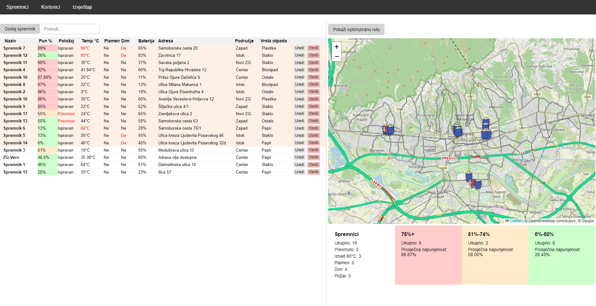

# Smart Waste Management Using the Internet of Things (IoT)

**Live Demo:** [Smart Waste Management Web Application](https://web-app-crimson-frog-9441.fly.dev)  
*Note: This project is a demonstration of IoT applications in waste management. Currently, the application does not support live tracking of waste bins and uses mock data for demonstration purposes. Users can manually adjust data for testing. To view relevant data on the **Reports** page, please select the date range from **September 9, 2024, to September 30, 2024**.*

## Table of Contents
- [About the Project](#about-the-project)
- [Technologies Used](#technologies-used)
- [Key Features](#key-features)
- [Project Structure](#project-structure)
- [How It Works](#how-it-works)

## About the Project
This project was created to showcase the application of the Internet of Things (IoT) in waste management. It employs sensors to monitor waste bin fill levels, detect environmental conditions, and optimize waste collection routes. The system's core includes a Raspberry Pi for processing sensor data and a web application that provides real-time data visualization and management.

Developed as part of the final assignment at VERN' University.

## Technologies Used
**Raspberry Pi 4B**:
- **Processor**: Quad-core Cortex-A72 (ARM v8) 64-bit SoC @ 1.5GHz
- **RAM**: 4GB LPDDR4-3200 SDRAM
- **Connectivity**: Wi-Fi, Bluetooth 5.0, Gigabit Ethernet
- **GPIO**: 40-pin GPIO header for sensor connections
- **Operating System**: Raspbian OS
  
**Sensors**:
- **Ultrasonic Sensor (HC-SR04)**: Used for measuring the fill level of the waste bins.
- **Temperature and Humidity Sensor (DS18B20)**: Monitors the temperature inside the bins.
- **Tilt Sensor (TCSW520)**: Detects the tilt of the bin, indicating if the bin has been overturned.
- **Smoke and Gas Sensor (MQ-2)**: Detects the presence of smoke and gases.
- **Flame Sensor (KY-026)**: Detects the presence of flames.
- **RFID Reader (MFRC-522)**: Identifies bins via RFID tags.
- **GPS Module (u-blox NEO-6M)**: Precisely locates bins.
  
**Web Application**:
- **Backend**: Node.js, Express.js
- **Frontend**: HTML, CSS, JavaScript, Google Maps API, Google Traffic API
- **Database**: SQLite
- **Server-Sent Events (SSE)**: Real-time updates for users about bin status changes.
- **Email Notifications**: Automated email system to notify users of significant events, such as bin full alerts or sensor malfunctions.

## Key Features
- **Real-Time Monitoring**: Sensors track fill levels, temperature, tilt, and detect fire or smoke in waste bins.
- **Route Optimization**: Algorithms optimize waste collection routes based on current traffic conditions and bin locations using Google Traffic API.
- **Web Application**: A user interface to manage bins, view real-time data, and generate reports.
- **User Management**: Adding and editing users, and linking them to specific bins.
- **Report Generation**: Analyze data through interactive charts showing long-term trends in bin fill levels and emptying frequency.
- **Real-Time Notifications**: Users receive real-time updates via SSE and email notifications for critical events.
- **Scalability**: The system can easily scale to accommodate more bins and sensors.

## Project Structure
- **sensors/**: Contains Raspberry Pi script responsible for gathering sensor data and sending it to the server.
- **web-app/**: A web application that displays real-time data, manages users, and optimizes waste collection routes.

## How It Works
1. **Sensors**: Measure waste bin fill levels, temperature, tilt, and detect fire or smoke.
2. **Raspberry Pi**: Central unit that processes sensor data and communicates with the web application.
3. **Web Application**: Displays real-time data, manages users, and optimizes collection routes using Google Traffic API for real-time traffic data.
4. **Real-Time Notifications**: Server-Sent Events (SSE) and email notifications keep users informed of important updates, such as when bins are full or when sensor issues are detected.
